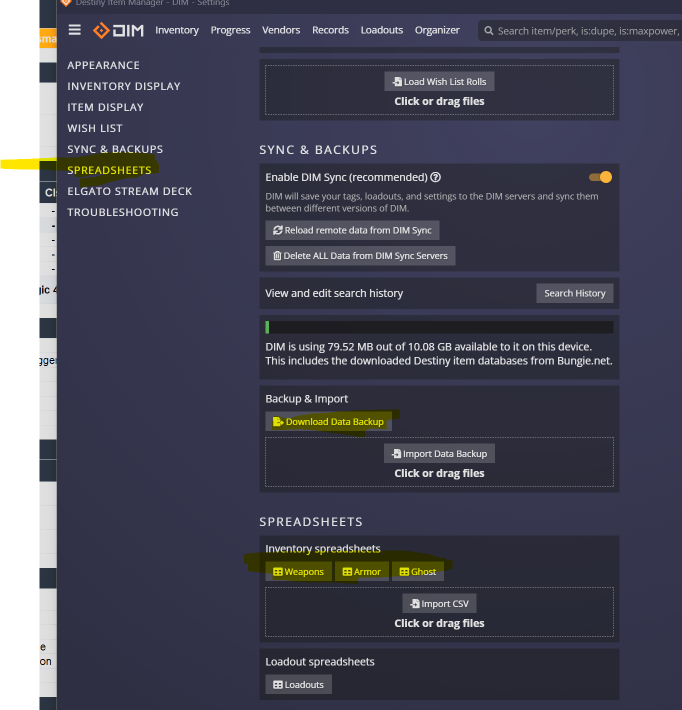

# Getting DIM CSV exports

DIM lets you export your entire inventory (weapons, armor, ghost shells) as CSV files. These are useful for the `WISHLIST` sheet — paste rows directly to track what you own and what perk rolls you're hunting.

---

## Steps

1. Open DIM at **<https://app.destinyitemmanager.com>**
2. Click the **gear icon** (Settings) in the top-right
3. Scroll the left sidebar down to **SPREADSHEETS**

4. Under **Inventory spreadsheets**, click the type you want:
   - **Weapons** → `destinyWeapons.csv`
   - **Armor** → `destinyArmor.csv`
   - **Ghost** → `destinyGhost.csv`
5. The CSV downloads to your Downloads folder.

You can also click **Download Backup Data** (yellow button under Backup & Import) for a complete JSON backup if you want to migrate DIM data between accounts.

---

## Using the CSV in this toolkit

Open the CSV in Excel and copy the rows you care about into the `WISHLIST` tab of `my_loadouts.xlsx`. The toolkit's `WISHLIST` columns follow DIM's order, so most columns line up.

**Tip:** filter the CSV before pasting — e.g., only weapons you flagged with the ⭐ tag in DIM, or only items with a specific perk like `Adrenaline Junkie`.

---

## What the CSV contains

For weapons:
- `Name`, `Hash`, `Id`, `Tag`, `Tier`, `Type`, `Source`
- `Element`, `Power`, `Masterwork Type`, `Masterwork Tier`
- All perk roll columns (`Perks 0`, `Perks 1`, ...)
- Locked status, equipped status

For armor:
- Same fields plus per-stat columns (Mobility / Resilience / Recovery / Discipline / Intellect / Strength) — or, in the post-Edge of Fate revamp, the 6 new stats (Health / Melee / Grenade / Super / Class / Weapons).

---

## Privacy note

Your CSVs only contain *your own* inventory. DIM doesn't have anyone else's data. The CSVs are downloaded directly from DIM's servers via your browser — they're never sent to this toolkit's repo.
